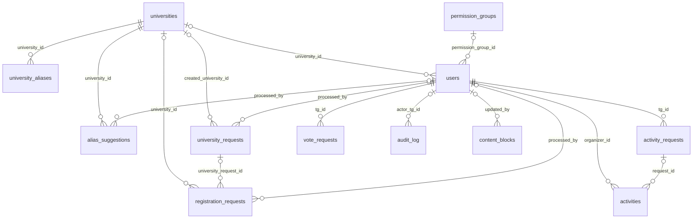

# База данных TTC — простая справка

В базе **12 таблиц**. Деньги (сборы, подписки, транзакции) в бете не нужны — их таблицы удалены
миграцией 0005 и вернутся новыми миграциями, когда дойдём. Мероприятия и голосования вернулись
в бету миграцией 0006 — в упрощённом виде (без денег и со-организаторов).

Актуально на: 2026-07-18.

---

## Как читать этот файл

**Связь** между таблицами — это когда в одной таблице лежит колонка с «номером» строки из другой таблицы.

Пример: у каждого человека в `users` есть колонка `university_id`. В ней лежит число, например `7`.
Это значит: «открой таблицу `universities`, найди строку, у которой `university_id = 7` — вот в этом вузе он учится».

Все связи записаны стрелками вида:

```
users.university_id  →  universities.university_id
(колонка тут)           (на какую колонку там указывает)
```

---

## Все 12 таблиц одной строкой

| Таблица | Что хранит |
|---|---|
| `users` | Участники сообщества (те, кого уже приняли) |
| `registration_requests` | Анкеты на вступление (каждая попытка — отдельная строка) |
| `universities` | Справочник вузов (полные названия) |
| `university_aliases` | Сокращения вузов для поиска («СПбГУ», «Политех») |
| `university_requests` | Заявки «моего вуза нет в списке — добавьте» |
| `alias_suggestions` | Предложения «добавьте вузу такое-то сокращение» |
| `activity_requests` | Заявки «хочу провести мероприятие» |
| `activities` | Одобренные мероприятия (карточки в Афише) |
| `vote_requests` | Заявки «вынесите вопрос на голосование» |
| `permission_groups` | Группы админских прав («Модераторы» и т.п.) |
| `audit_log` | Журнал: кто из админов что сделал и когда |
| `content_blocks` | Тексты и картинки бота, редактируемые через /content |

---

## Картинка связей



На каждой стрелке написана колонка, через которую идёт связь.

---

## Полный список связей (стрелка = «указывает на»)

| Откуда | Куда | Что это значит по-человечески |
|---|---|---|
| `university_aliases.university_id` | → `universities.university_id` | Чьё это сокращение |
| `alias_suggestions.university_id` | → `universities.university_id` | Какому вузу предлагают сокращение |
| `users.university_id` | → `universities.university_id` | В каком вузе учится человек (пусто = не учится в СПб) |
| `registration_requests.university_id` | → `universities.university_id` | Какой вуз выбрал в анкете |
| `university_requests.created_university_id` | → `universities.university_id` | Какой вуз в итоге создали по этой заявке (заполняется после «Принять») |
| `registration_requests.university_request_id` | → `university_requests.request_id` | Эта анкета ждёт: сначала решается заявка на вуз, потом сама анкета |
| `users.permission_group_id` | → `permission_groups.group_id` | В какой группе прав состоит человек (пусто = ни в какой) |
| `registration_requests.processed_by` | → `users.tg_id` | Какой админ принял/отклонил анкету |
| `university_requests.processed_by` | → `users.tg_id` | Какой админ решил заявку на вуз |
| `alias_suggestions.processed_by` | → `users.tg_id` | Какой админ решил заявку на сокращение |
| `activity_requests.tg_id` | → `users.tg_id` | Кто предложил мероприятие (здесь связь ЕСТЬ: подать может только участник) |
| `activity_requests.processed_by` | → `users.tg_id` | Какой админ решил заявку на мероприятие |
| `activities.organizer_id` | → `users.tg_id` | Кто организатор мероприятия |
| `activities.request_id` | → `activity_requests.request_id` | Из какой заявки мероприятие появилось |
| `vote_requests.tg_id` | → `users.tg_id` | Кто предложил голосование |
| `vote_requests.processed_by` | → `users.tg_id` | Какой админ решил заявку на голосование |
| `audit_log.actor_tg_id` | → `users.tg_id` | Кто совершил действие (пусто = сам бот) |
| `content_blocks.updated_by` | → `users.tg_id` | Кто последним менял этот текст/картинку |

**Важная НЕ-связь.** В `registration_requests`, `university_requests` и `alias_suggestions`
есть колонка `tg_id` — Telegram-номер заявителя. Она **специально не связана** с `users`:
человек подаёт заявку, когда его в `users` ещё нет (туда он попадёт только после одобрения).
А вот в `activity_requests` и `vote_requests` такая же колонка `tg_id` **связана** с `users` —
эти заявки подают только уже принятые участники.

---

## Теперь каждая таблица подробно

### `users` — участники сообщества

Строка появляется **только** когда админ нажал «Принять» на анкете. Есть строка (и роль не «banned») — значит человек уже в сообществе, и бот не даст ему зарегистрироваться второй раз.

| Колонка | Что лежит |
|---|---|
| `tg_id` | Telegram-номер человека. **Главный ключ** — по нему таблицу находят все остальные |
| `username` | @имя в Telegram (может не быть) |
| `display_name` | Имя/ник — как человек просил к нему обращаться |
| `university_id` | → `universities`. Пусто у тех, кто «не учусь в вузах СПб» |
| `university_group` | Учебная группа (просто текст) |
| `birth_date` | Дата рождения |
| `about_text` | Рассказ «о себе» (заполнен у тех, кто без вуза) |
| `current_role` | Роль: `user` / `organizer` / `admin` / `custom` / `banned` |
| `role_before_ban` | Какая роль была до бана — чтобы разбан вернул её |
| `custom_permissions` | Личные модули прав, например `{"modules": ["content"]}` |
| `permission_group_id` | → `permission_groups`. Если группу удалить — тут станет пусто, человек не сломается |
| `banned_at`, `banned_reason` | Когда и за что забанен |
| `registration_date`, `updated_at` | Когда принят, когда последний раз менялась строка |

### `registration_requests` — анкеты на вступление

Каждая попытка регистрации — новая строка. Старые не удаляются, так сохраняется вся история.

| Колонка | Что лежит |
|---|---|
| `request_id` | Номер анкеты (UUID — длинный уникальный код) |
| `tg_id` | Telegram-номер заявителя (НЕ связь — см. выше) |
| `full_name` | Имя/ник из анкеты |
| `university_id` | → `universities`. Пусто, если вуза ещё нет в справочнике или человек «не учится» |
| `university_group` | Учебная группа |
| `birth_date` | Дата рождения |
| `about_text` | «О себе» (ветка без вуза) |
| `university_request_id` | → `university_requests`. Заполнено = анкета ждёт решения по вузу |
| `raw_input_snapshot` | Что человек вводил дословно (на всякий случай) |
| `status` | `pending` (ждёт) / `approved` (принята) / `rejected` (отклонена) |
| `attempt_number` | Которая это попытка по счёту |
| `next_allowed_attempt` | Раньше этого времени новую анкету подать нельзя (штраф растёт: 0, 10, 30, 70… мин) |
| `processed_by` | → `users.tg_id` — админ, который решил |
| `processed_at`, `admin_comment`, `created_at` | Когда решено, комментарий админа, когда подана |

### `universities` — справочник вузов

Чтобы «СПбГУ», «спбгу» и «Санкт-Петербургский государственный университет» были одним вузом, а не тремя.

| Колонка | Что лежит |
|---|---|
| `university_id` | Номер вуза. **Главный ключ** |
| `canonical_name` | Полное официальное название (двух одинаковых быть не может) |
| `city` | Город |
| `is_verified` | `true` = вуз из проверенного списка; `false` = добавлен по заявке пользователя |
| `created_at` | Когда добавлен |

### `university_aliases` — сокращения для поиска

Одна строка = одно сокращение. У вуза их может быть сколько угодно. Если вуз удалить — его сокращения удалятся сами.

| Колонка | Что лежит |
|---|---|
| `alias_id` | Номер строки |
| `university_id` | → `universities` — чьё сокращение |
| `alias_text` | Само сокращение («Политех», «ИТМО») |

### `university_requests` — заявки «добавьте мой вуз»

Подаётся из анкеты, когда человек не нашёл свой вуз. Решается **раньше** самой анкеты.

| Колонка | Что лежит |
|---|---|
| `request_id` | Номер заявки (UUID) |
| `tg_id`, `applicant_name`, `applicant_username` | Кто подал (снимок на момент подачи) |
| `name` | Полное название вуза, как его написал человек |
| `aliases` | Список предложенных сокращений (до 5) |
| `link` | Ссылка на сайт/группу вуза — чтобы админ проверил, что вуз существует |
| `status` | `pending` / `approved` / `rejected` |
| `processed_by` | → `users.tg_id` — админ, который решил |
| `processed_at`, `admin_comment` | Когда и с каким комментарием |
| `created_university_id` | → `universities` — вуз, который создали по этой заявке |
| `created_at` | Когда подана |

### `alias_suggestions` — предложения сокращений

Появляются, когда человек на вопрос «удобно ли было искать вуз?» ответил «Нет» и прислал свои варианты. Каждый вариант — отдельная строка (можно одну принять, другую отклонить).

| Колонка | Что лежит |
|---|---|
| `suggestion_id` | Номер предложения (UUID) |
| `university_id` | → `universities` — какому вузу |
| `tg_id`, `applicant_name`, `applicant_username` | Кто предложил |
| `alias_text` | Само предложенное сокращение |
| `status` | `pending` / `approved` / `rejected` |
| `processed_by`, `processed_at` | Кто из админов и когда решил |
| `created_at` | Когда предложено |

### `activity_requests` — заявки на мероприятия

Участник в ЛС бота нажимает «📅 Предложить мероприятие» и заполняет форму. Карточка уходит админам.

| Колонка | Что лежит |
|---|---|
| `request_id` | Номер заявки (UUID) |
| `tg_id` | → `users.tg_id` — кто предложил |
| `title` | Название мероприятия |
| `description` | Описание (что, где, когда) — оно же попадёт в Афишу |
| `extra_url` | Ссылка (чат мероприятия, пост, регистрация) — может быть пустой |
| `status` | `pending` / `approved` / `rejected` |
| `processed_by`, `processed_at` | Какой админ и когда решил |
| `created_at` | Когда подана |

### `activities` — одобренные мероприятия

Появляется при нажатии «Принять» на заявке. Бот сразу публикует карточку в топик «Афиша»,
а автор с ролью «пользователь» автоматически становится «организатором». Когда админ через
/activities помечает мероприятие завершённым или отменённым — карточка в Афише правится,
и если у организатора не осталось активных мероприятий, роль «организатор» снимается.

| Колонка | Что лежит |
|---|---|
| `activity_id` | Номер мероприятия (UUID) |
| `organizer_id` | → `users.tg_id` — организатор |
| `title`, `description`, `extra_url` | Скопированы из заявки |
| `status` | `active` (идёт) / `completed` (прошло) / `cancelled` (отменено) |
| `afisha_message_id` | Номер сообщения-карточки в Афише — чтобы пометить её при закрытии |
| `request_id` | → `activity_requests` — из какой заявки создано |
| `created_at`, `updated_at` | Когда одобрено / когда менялось |

### `vote_requests` — заявки на голосования

Участник нажимает «📊 Предложить голосование», пишет вопрос и варианты ответа.
После «Принять» бот публикует настоящий Telegram-опрос в топик «Голосования».

| Колонка | Что лежит |
|---|---|
| `request_id` | Номер заявки (UUID) |
| `tg_id` | → `users.tg_id` — кто предложил |
| `question` | Вопрос голосования |
| `options` | Список вариантов ответа (от 2 до 10) |
| `status` | `pending` / `approved` / `rejected` |
| `processed_by`, `processed_at` | Какой админ и когда решил |
| `poll_message_id` | Номер сообщения с опросом в топике «Голосования» |
| `created_at` | Когда подана |

### `permission_groups` — группы админских прав

Группа = название + набор включённых модулей. Права человека = модули его группы **плюс** его личные модули (`users.custom_permissions`). Полный админ (роль `admin`) может всё и без групп.

| Колонка | Что лежит |
|---|---|
| `group_id` | Номер группы. **Главный ключ** |
| `name` | Название («Модераторы») — двух одинаковых быть не может |
| `modules` | Список включённых модулей, например `["registration", "content"]` |
| `created_at`, `updated_at` | Когда создана / когда меняли |

Какие бывают модули: `registration` (решать анкеты), `universities` (решать заявки на вузы и сокращения), `content` (менять тексты бота через /content), `moderation` (/ban и /unban), `activities` (решать заявки на мероприятия и голосования, /activities).

### `audit_log` — журнал действий

Только дописывается, никогда не правится и не удаляется. По нему всегда можно восстановить, кто что сделал.

| Колонка | Что лежит |
|---|---|
| `log_id` | Номер записи |
| `actor_tg_id` | → `users.tg_id` — кто сделал (пусто = бот сам) |
| `actor_type` | `admin` или `system` |
| `action_type` | Что сделано: `registration_approved`, `user_banned`, `perm_group_created`… |
| `target_tg_id` | Над кем (если действие над человеком) |
| `target_entity_type`, `target_entity_id` | Над чем (тип и номер: анкета, заявка на вуз…) |
| `reason` | Причина (если указывали) |
| `metadata` | Дополнительные детали в свободной форме |
| `created_at` | Когда |

### `content_blocks` — редактируемые тексты бота

То, что админ меняет командой /content без программиста: приветствие, «Кто мы?».

| Колонка | Что лежит |
|---|---|
| `slot` | Имя блока («welcome», «about»). **Главный ключ** |
| `text` | Текст блока |
| `file_id`, `file_type` | Прикреплённые фото/документ (номер файла в Telegram) |
| `updated_by` | → `users.tg_id` — кто последним менял |
| `updated_at` | Когда |

---

## Справочные мелочи

**Списки допустимых значений (enum), их всего 4:**

| Название | Значения | Где используется |
|---|---|---|
| `user_role` | user, organizer, admin, custom, banned | `users.current_role`, `users.role_before_ban` |
| `request_status` | pending, approved, rejected | статус во всех пяти таблицах заявок |
| `activity_status` | active, completed, cancelled | `activities.status` |
| `actor_type` | admin, system | `audit_log.actor_type` |

**История миграций** (как база дошла до текущего вида):

| Миграция | Что сделала |
|---|---|
| `0001` | Все первоначальные таблицы |
| `0002` | + `content_blocks` |
| `0003` | + `university_requests`, `alias_suggestions`; в анкеты и users добавлено «о себе» |
| `0004` | + `permission_groups` и привязка людей к группам |
| `0005` | − удалены 6 неиспользуемых таблиц будущих фаз (мероприятия и деньги) |
| `0006` | + мероприятия и голосования в упрощённом виде: `activity_requests`, `activities`, `vote_requests` |

**Посмотреть базу своими глазами:**

```
docker compose exec postgres psql -U ttc -d ttc -c "\dt"
```

(⚠️ если писать SQL руками: колонку роли запрашивать как `users.current_role`, с именем таблицы —
слово `current_role` без него PostgreSQL понимает как свою встроенную функцию и вернёт ерунду).

В списке таблиц будет ещё тринадцатая — `alembic_version`: это служебная запись «до какой миграции
дошла база», её создаёт сам инструмент миграций, трогать не нужно.
