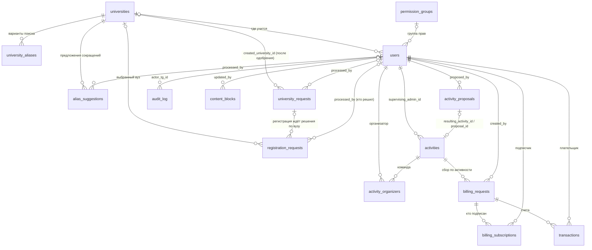

# База данных TTC

PostgreSQL 16 (Docker-сервис `postgres`, БД `ttc`) + расширение `pg_trgm` для нечёткого поиска вузов.
Схема управляется Alembic-миграциями `0001 → 0004`; модели — в [bot/db/models/](../bot/db/models/).
FSM-состояния анкет живут **не здесь**, а в Redis — в БД попадают только готовые заявки.

Актуально на: 2026-07-16 (миграция `0004_permission_groups`).

---

## Карта связей

Важная особенность: в `registration_requests`, `university_requests` и `alias_suggestions` поле `tg_id`
заявителя — **не** FK на `users`. Строка в `users` появляется только после одобрения регистрации,
а заявку подаёт человек, которого в `users` ещё нет.

---

## Домен «Люди и регистрация»

### `users` — участники сообщества
Создаётся **только** при одобрении заявки админом (не при `/start`). Наличие строки с ролью ≠ `banned` = «уже зарегистрирован, повторная регистрация закрыта».

| Колонка | Тип | Описание |
|---|---|---|
| `tg_id` | bigint **PK** | Telegram ID (не автоинкремент) |
| `username` | varchar(32) null, index | @username на момент апдейта |
| `display_name` | varchar(255) | Имя/ник — как обращаться (не паспортное ФИО) |
| `university_id` | int null → `universities` | Null у тех, кто «не учится в вузах СПб» |
| `university_group` | varchar(50) null | Учебная группа |
| `birth_date` | date null | |
| `about_text` | text null | «О себе» — заполнено у зарегистрированных без вуза |
| `current_role` | enum `user_role` | user / organizer / admin / custom / banned |
| `role_before_ban` | enum null | Для корректного разбана |
| `custom_permissions` | JSONB null | Личные модули прав: `{"modules": ["content", ...]}` |
| `permission_group_id` | int null → `permission_groups` (ON DELETE SET NULL) | Группа прав |
| `banned_at` / `banned_reason` | timestamptz / text, null | |
| `registration_date` / `updated_at` | timestamptz | |

### `registration_requests` — заявки на вступление
Каждая попытка — новая строка (история сохраняется). Индекс `(tg_id, status)`.

| Колонка | Тип | Описание |
|---|---|---|
| `request_id` | UUID **PK** | |
| `tg_id` | bigint, index | Заявитель (НЕ FK — см. выше) |
| `full_name` | varchar(255) | Имя/ник |
| `university_id` | int null → `universities` | Null: вуз из заявки ещё не создан, или «не учусь» |
| `university_group` | varchar(50) null | |
| `birth_date` | date | |
| `about_text` | text null | Ветка «не учусь в вузах СПб» |
| `university_request_id` | UUID null → `university_requests` | Заполнено, если человек подал заявку на новый вуз: карточка регистрации уходит админам только **после** решения по вузу |
| `raw_input_snapshot` | JSONB null | Что человек вводил до нормализации |
| `status` | enum `request_status`, index | pending / approved / rejected |
| `attempt_number` | int | Номер попытки |
| `next_allowed_attempt` | timestamptz null | Тайм-аут T_n = 10×(2^(n−1)−1) мин, потолок 72 ч |
| `processed_by` | bigint null → `users.tg_id` | Кто решил |
| `processed_at` / `admin_comment` / `created_at` | | |

---

## Домен «Вузы»

### `universities` — справочник (канонические названия)
GIN-индекс `gin_trgm_ops` по `canonical_name` — нечёткий поиск, терпимый к опечаткам.

| Колонка | Тип | Описание |
|---|---|---|
| `university_id` | serial **PK** | |
| `canonical_name` | varchar(255) unique | Полное официальное название |
| `city` | varchar(255) null | |
| `is_verified` | bool default true | false = добавлен по заявке пользователя |
| `created_at` | timestamptz | |

### `university_aliases` — варианты поиска («СПбГУ», «Политех»…)
GIN-индекс `gin_trgm_ops` по `alias_text`. Удаление вуза каскадно удаляет алиасы.

| Колонка | Тип |
|---|---|
| `alias_id` | serial **PK** |
| `university_id` | int → `universities` (ON DELETE CASCADE) |
| `alias_text` | varchar(255) |

### `university_requests` — заявки «моего вуза нет в списке»
Решается **раньше** связанной регистрации. При одобрении создаётся вуз (или переиспользуется существующий по точному имени) → ссылка пишется в `created_university_id`, а в связанной `registration_requests` проставляется `university_id`.

| Колонка | Тип | Описание |
|---|---|---|
| `request_id` | UUID **PK** | |
| `tg_id` | bigint, index | Заявитель (НЕ FK) |
| `applicant_name` / `applicant_username` | varchar | Снимок на момент подачи |
| `name` | varchar(255) | Полное название вуза |
| `aliases` | JSONB (список) | До 5 сокращений |
| `link` | varchar(512) | Сайт/группа/канал для проверки |
| `status` | enum `request_status`, index | |
| `processed_by` | bigint null → `users.tg_id` | |
| `processed_at` / `admin_comment` | | |
| `created_university_id` | int null → `universities` | Итог одобрения |
| `created_at` | timestamptz | |

### `alias_suggestions` — предложения сокращений к существующему вузу
Ответ «Нет» на вопрос «удобно ли было искать?» → до 5 предложений, каждое — отдельная заявка. Лимит на человека считается по индексу `(tg_id, university_id)`.

| Колонка | Тип | Описание |
|---|---|---|
| `suggestion_id` | UUID **PK** | |
| `university_id` | int → `universities` (ON DELETE CASCADE) | |
| `tg_id` | bigint | Заявитель (НЕ FK) |
| `applicant_name` / `applicant_username` | varchar | |
| `alias_text` | varchar(255) | Предлагаемое сокращение |
| `status` | enum `request_status`, index | |
| `processed_by` / `processed_at` / `created_at` | | |

---

## Домен «Права админов»

### `permission_groups` — именованные наборы модулей
Эффективные права человека = модули его группы ∪ личные `custom_permissions.modules`.
Полный админ (`current_role = admin`) может всё без групп. Удаление группы отвязывает участников (`SET NULL`), их личные модули сохраняются.

| Колонка | Тип | Описание |
|---|---|---|
| `group_id` | serial **PK** | |
| `name` | varchar(100) unique | |
| `modules` | JSONB (список) | Ключи из `PermissionModule`: `["registration", "content"]` |
| `created_at` / `updated_at` | timestamptz | |

Модули (enum `PermissionModule` в коде, в БД хранятся строками в JSONB):

| Ключ | Даёт право |
|---|---|
| `registration` | Принимать/отклонять заявки на регистрацию |
| `universities` | Заявки на вузы и варианты поиска |
| `content` | Редактор текстов и файлов (`/content`) |
| `moderation` | `/ban`, `/unban` |

---

## Домен «Активности» *(схема готова, логика — Фаза 2)*

### `activity_proposals` — идеи до одобрения
`proposal_id` UUID PK · `proposed_by` → users · `title`, `description` · `implementation_plan_url`, `chat_url` null · `admin_comment_from_proposer` null · `wants_pre_vote` bool · `vote_poll_message_id` bigint null · `vote_poll_status` enum(not_requested / pending_admin_approval / posted / closed) · `status` enum request_status · `processed_by` / `processed_at` / `admin_comment` · `resulting_activity_id` → activities (use_alter, заполняется при одобрении) · `created_at`

### `activities` — одобренные проекты/мероприятия
`activity_id` UUID PK · `title`, `description` · `status` enum(preparing / active / completed / cancelled) · `implementation_plan_url`, `chat_url` · `supervising_admin_id` → users · `admin_comment` · `proposal_id` → activity_proposals null (админ может создать активность напрямую) · `afisha_status` enum(none / requested / published) + `afisha_requested_at` / `afisha_published_at` · `created_at` / `updated_at`

### `activity_organizers` — команда активности (M:N)
Составной PK (`activity_id`, `organizer_id`), оба FK с CASCADE · `added_at`.
Именно по этой таблице работает авто-повышение/понижение роли organizer: нет ни одной строки с активностью в preparing/active → понижение (только если роль сейчас `organizer`).

---

## Домен «Биллинг» *(схема готова, логика — Фаза 3)*

### `billing_requests` — заявки на сбор средств
`billing_id` UUID PK · `activity_id` → activities · `created_by` → users · `billing_type` enum(one_time / monthly) · `amount` numeric(10,2), `currency` default 'RUB' · `target_type` enum(all / specific) + `target_users_raw` JSONB (снимок при подаче) · `description` · `status` enum request_status · `is_active` bool (пауза сбора — отдельно от одобрения) · `approved_by` / `approved_at` · `created_at`

### `billing_subscriptions` — кто подписан на сбор
Составной PK (`billing_id`, `user_id`) · `is_active` bool (кнопка «Деактивировать» переключает именно его) · `enrolled_at` · `cancelled_at` null

### `transactions` — счета по периодам
`transaction_id` UUID PK · `billing_id` → billing_requests · `user_id` → users · `billing_period` date null (null = разовый сбор) · `amount` (снимок суммы) · `payment_status` enum(pending / paid / failed / cancelled) · `payment_provider_reference` null (заполнит Фаза 4 — ЮKassa) · `created_at` / `updated_at`

Защита от дублей — два partial unique index (обычный UNIQUE не ловит one-time случай, т.к. Postgres считает NULL различными):
- `(billing_id, user_id)` WHERE `billing_period IS NULL`
- `(billing_id, user_id, billing_period)` WHERE `billing_period IS NOT NULL`

---

## Служебные таблицы

### `audit_log` — журнал действий (append-only, работает уже сейчас)
`log_id` bigserial PK · `actor_tg_id` → users null (null = система) · `actor_type` enum(admin / system) · `action_type` varchar(50), index — **не** enum в БД, список растёт (см. `AuditAction` в [bot/enums.py](../bot/enums.py): registration_approved, university_request_approved, alias_approved, perm_group_created, user_permissions_changed…) · `target_tg_id` bigint null · `target_entity_type` varchar(30) null · `target_entity_id` varchar(64) null (строка — ID полиморфны: bigint и UUID) · `reason` text null · `metadata` JSONB null · `created_at`, index

### `content_blocks` — редактируемые тексты/файлы бота (`/content`)
`slot` varchar(50) PK (допустимые ключи заданы в коде) · `text` null · `file_id` / `file_type` null (Telegram file_id) · `updated_by` → users null · `updated_at`

---

## Enum-типы PostgreSQL

| Тип в БД | Значения | Где используется |
|---|---|---|
| `user_role` | user, organizer, admin, custom, banned | users ×2 |
| `request_status` | pending, approved, rejected | все 5 таблиц заявок |
| `activity_status` | preparing, active, completed, cancelled | activities |
| `vote_poll_status` | not_requested, pending_admin_approval, posted, closed | activity_proposals |
| `afisha_status` | none, requested, published | activities |
| `billing_type` | one_time, monthly | billing_requests |
| `target_type` | all, specific | billing_requests |
| `payment_status` | pending, paid, failed, cancelled | transactions |
| `actor_type` | admin, system | audit_log |

`PermissionModule` — enum только на уровне Python; в БД модули лежат строками внутри JSONB.

---

## Миграции

| Ревизия | Что добавила |
|---|---|
| `0001_initial_schema` | pg_trgm, все enum-типы, universities, university_aliases, users, registration_requests, activity_proposals, activities, activity_organizers, billing_requests, billing_subscriptions, transactions, audit_log |
| `0002_content_blocks` | content_blocks |
| `0003_university_requests` | university_requests, alias_suggestions; в registration_requests: `about_text`, `university_request_id`, `university_id`/`university_group` стали nullable; в users: `about_text` |
| `0004_permission_groups` | permission_groups; в users: `permission_group_id` (FK, ON DELETE SET NULL) |

Проверить живую схему: `docker compose exec postgres psql -U ttc -d ttc -c "\dt"` (⚠️ в сыром SQL к `users.current_role` обращаться только с префиксом таблицы — `current_role` без префикса — это встроенная функция PostgreSQL).
